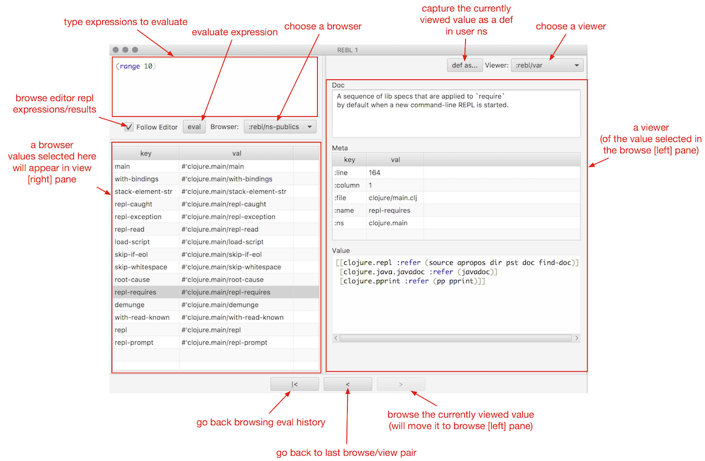

# `REBL`

## Read-Eval-Browse-Loop

REBL is a graphical, interactive tool for browsing Clojure data. It features:

* a two-pane browser/viewer system for viewing collections and their contents
* navigation into and back out of nested collections
* a structured editor pane for entering expressions to be evaluated
* a root browse of a history of expression evaluations
* the ability to 'wrap' a stdio based REPL (e.g. Clojure's native REPL) so that it can monitor and display the interactions therein, while still allowing them to flow back to the host (e.g. the editor)
* when used with non-stdio repls (e.g. nREPL), can be launched a la carte and accepts values to inspect via an API call
* the ability to capture nested values as defs in the user namespace
* the ability to run multiple independent UI windows
* metadata viewing
* datafy support
* extensibility to new browsers and viewers
* full keyboard control via [hotkeys](https://github.com/cognitect-labs/rebl/wiki/Hotkeys)



REBL runs in your application JVM process, and can be used at dev-time without adding any runtime deps. The UI is written in JavaFX.

## Requirements

* Clojure, 1.10.0 or higher
* Java
  * Java 8 1.8.0_151 or higher, with embedded JavaFX or OpenJavaFX
    * Distributions include: Oracle, Azul, BellSoft Liberica, Amazon Coretto
    * AdoptOpenJDK DOES NOT include OpenJavaFX and is not supported
      * Either use Java 11+ or see these [suggestions](https://github.com/AdoptOpenJDK/openjdk-build/issues/577#issuecomment-557496591) (unupported)
  * Java 11 or higher with external OpenJavaFX (see below)

## Usage:

[Get the Cognitect dev-tools](https://cognitect.com/dev-tools) and
[configure the dev-tools maven repository](https://cognitect.com/dev-tools/maven.html).

Add an alias to your `~/.clojure/deps.edn` (to enable for all
projects) or to an individual project's `deps.edn`:

``` clj
{:aliases
 {:rebl        ;; for JDK 11+
  {:extra-deps {com.cognitect/rebl          {:mvn/version "${REBL-VERSION}"}
                org.openjfx/javafx-fxml     {:mvn/version "15-ea+6"}
                org.openjfx/javafx-controls {:mvn/version "15-ea+6"}
                org.openjfx/javafx-swing    {:mvn/version "15-ea+6"}
                org.openjfx/javafx-base     {:mvn/version "15-ea+6"}
                org.openjfx/javafx-web      {:mvn/version "15-ea+6"}}
   :main-opts ["-m" "cognitect.rebl"]}
  :rebl-jdk8   ;; for JDK 8
  {:extra-deps {com.cognitect/rebl {:mvn/version "${REBL-VERSION}"}}
   :main-opts ["-m" "cognitect.rebl"]}}}
```

Replace your normal repl invocation (`clj`, or `clojure` e.g. for
inferior-lisp) with the appropriate alias for your JDK version:

    # for JDK 11+
    clj -A:rebl

    # for JDK 8
    clj -A:rebl-jdk8`

Your repl should start, along with the REBL UI. Everything you type in the repl will also appear in REBL. You can also type expressions right into REBL's editor (in the upper left). REBL will maintain a history of exprs+results in the root browse table.

You can start more UIs with `(cognitect.rebl/ui)`

You can also use REBL with
[boot](https://github.com/cognitect-labs/rebl/wiki/Using-REBL-with-Boot)
or
[lein](https://github.com/cognitect-labs/rebl/wiki/Using-REBL-with-Leiningen).

## Local Builds

     (require 'ci)
     (ci/build cr/project)

## Releasing

"CI" must be done locally until we have CI server support.

     (require 'ci)
     (ci/deploy ci/project)

Test the release you built locally.

Read the version number from the deploy output, and then review the
release plan:

     (ci/release-plan ci/project <version number like "0.9.220" here>)

Then release!

     (ci/release ci/project <version number like "0.9.220" here>)

Verify that the download works at http://rebl.cognitect.com/download.html.

Add release notes to the wiki at
https://github.com/cognitect-labs/REBL-distro/wiki/ReleaseHistory.

Post on patreon https://www.patreon.com. Copy the previous post and
change the links.


## How Releases Work

Public releases are sourced from `private-releases-1fc2183a` which is
a private bucket.

The REBL download page can create time limited S3 download links as
follows:

Read `s3://private-releases-1fc2183a/releases/REBL/manifest.edn`,
which contains a map describing the current release.

    {:current {:bucket "<bucket-name>"
               :key "<KEY>"}}

## Adding an extension

    cognitect.rebl.impl.monaco/init-listener

is a listener that is configured to run when the editor is successfully loaded.

From `init-listener` (or `register-callbacks` in the same ns), call
 
    cognitect.rebl.impl.js/call
    
to call Javascript functions from Java. This function will handle marshaling of data between Java and Javascript.

See https://docs.oracle.com/javase/8/javafx/api/javafx/scene/web/WebEngine.html for details about marshaling objects.
See https://microsoft.github.io/monaco-editor/api/modules/monaco.languages.html for the list of providers available through Monaco.
